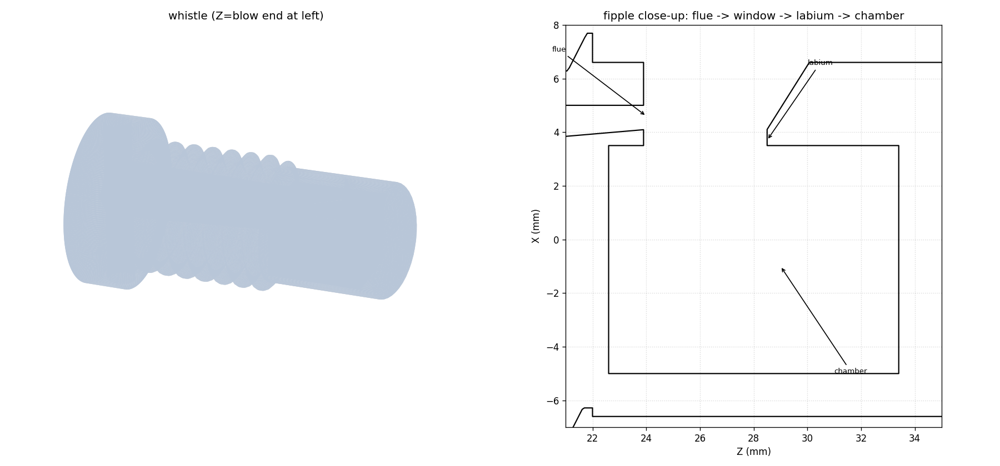
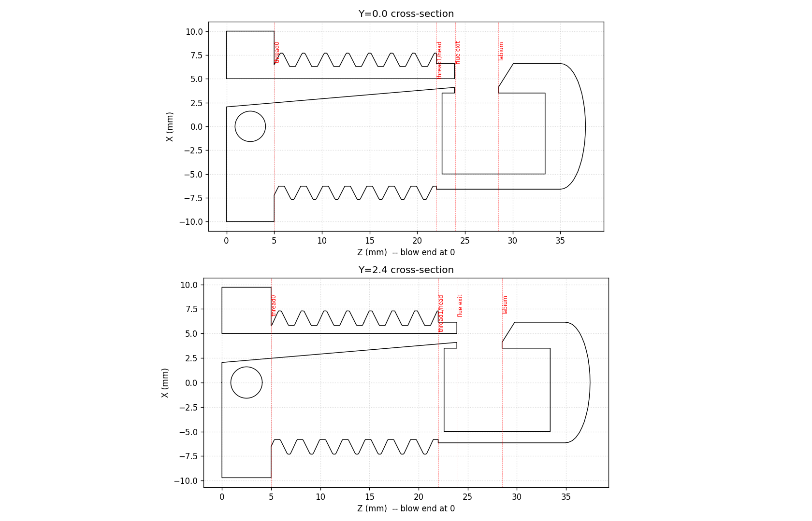

# Hex-Nut Whistle 🔩🎵

A working fipple whistle whose shank is threaded **5/8″-11 UNC** so it screws
into a standard **5/8″-11 Heavy Hex Nut**. The nut is captured on the shank
between the mouthpiece flange and the whistle head, turning a chunk of
hardware-store steel into the body of a loud little whistle.




## Files
| File | What it is |
|------|------------|
| `whistle_hexnut.stl` | **The printable model.** Watertight, ready to slice. |
| `gen_whistle.py` | Parametric generator (numpy + trimesh + manifold3d). Edit the params at the top and re-run to retune. |
| `render.py` / `render3d.py` | Produce the verification/preview PNGs. |

Regenerate with:
```bash
pip install numpy trimesh manifold3d matplotlib
python3 gen_whistle.py      # writes whistle_hexnut.stl + checks the air path
python3 render3d.py         # writes preview images
```

## Dimensions
- **Overall:** Ø20 mm flange × **37.6 mm** long
- **Threaded shank:** 5/8″-11 UNC, 17 mm long (printed Ø undersized 0.5 mm for fit)
- **Head:** Ø13.2 mm — deliberately **smaller than the nut bore (~13.6 mm)** so the
  nut slides over the head during assembly
- **Estimated pitch:** ~3.9 kHz (Helmholtz resonator) — a sharp, high whistle

## The mating nut
5/8″-11 **Heavy** Hex Nut (ASME B18.2.2):
- Width across flats **1.0625″ (27.0 mm)**, across corners **~1.227″ (31.2 mm)**
- Thickness **39/64″ ≈ 0.609″ (15.48 mm)**
- Thread 5/8″-11 UNC, right-hand

## Assembly
1. Print the whistle (see below).
2. Slide the hex nut **over the head end** (head Ø13.2 < nut bore).
3. Screw the nut down the 17 mm thread until it seats against the flange.
4. The head + window protrude past the nut — blow into the rectangular
   mouthpiece hole on the flange end.

The flange has a Ø3.2 mm lanyard hole for a keyring.

## How it makes sound (the fipple)
```
 blow ─► [ tapering windway ] ─► flue (0.9 mm flat jet)
                                   │
                                   ▼  jet crosses the open WINDOW
                                 ──┴── and splits on the sharp LABIUM
                                   │
                                   ▼
                          closed resonant CHAMBER  ◄─ Helmholtz resonator
```
The thin flat jet from the flue is steered alternately to the outside air and
into the chamber by the labium edge; the chamber resonance locks this
oscillation to a tone that radiates from the window.

## Printing
- **Material:** PLA or PETG.
- **Orientation:** stand it on the flange (blow end down) so the windway,
  flue and labium print as horizontal layers across the air gap — this keeps
  the critical 0.9 mm flue and the labium edge crisp without supports.
- **Layer height:** 0.12–0.16 mm (the flue and labium are small features).
- **Walls/infill:** 3 perimeters, ≥30 % infill — it should be airtight.
- No supports needed; the window and chamber are self-supporting at this size.

## Tuning (after a test print)
All in `gen_whistle.py`:
| Symptom | Param | Try |
|---------|-------|-----|
| Won't make sound / airy | `CUTUP` | ±0.2 mm (labium height vs jet) |
| Pitch too low / too high | `Z_CHAM1` (chamber length) | shorter = higher |
| Hard to blow / shrill | `FLUE_H` | 0.8–1.1 mm |
| Thread too tight in nut | `PRINT_CLEAR` | increase (e.g. 0.3) |
| Thread too loose | `PRINT_CLEAR` | decrease (e.g. 0.15) |

The generator prints an **AIR PATH CONTINUOUS** check on every run to confirm
the windway → flue → window → chamber passage didn't seal during the booleans.
